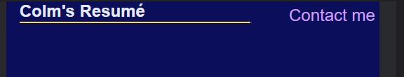

<h1 align="center">Colm's Resume Website</h1>

[View the live project here.](https://colm1711.github.io/colms_resume_site)

This is the main website of Colm's resume website is for users to see details about me & my current resume, skills & to get in touch for an interview or a job opportunity. It is designed to be responsive and accessible on a wide range of devices, making it easy to navigate for potential employers. This is a platform for users to check my code, get to know more about me, which technologies I'm using or studying, contact me and follow me on social media and hopefully hire me!

</img>

## User Experience (UX)

-   ### User stories

    -   #### First Time Visitor Goals

        1. As a First Time Visitor, I want to easily understand the main purpose of the site and learn more about Colm and his current experience to see if he is a candidate for role.
        2. As a First Time Visitor, I want to be able to easily navigate throughout the site to find content.
        3. As a First Time Visitor, I want to locate his social media with links to see his followings on social media to determine users think of them are they trusted & if they are good candidate and fit for company culture.


    -   #### Returning Visitor Goals

        1. As a Returning Visitor, I want to find information about his skills.
        2. As a Returning Visitor, I want to find the best way to get in contact information to see if we can reach out for interview.
        3. As a Returning Visitor, I want to about me to know more abuot him in advance of interview and see what his interests are.

    -   #### Frequent User Goals
        1. As a Frequent User, I want to check to see if there are any newly added projects and if they are improving.
        2. As a Frequent User, I want to contact form so that I can email and notify of job roles, jobs or any major updates.


-   ### Design
    -   #### Colour Scheme
        -   was choosen from [colorpyschology.org](https://www.colorpsychology.org/shades-of-blue/) and validated [here](https://color.a11y.com/Contrast/)

        -   color was choosen for these reasons:<br>
                

    -   #### Typography
        -   was sourced from [Google fonts](https://fonts.google.com/)

        -   font was chosen as subset of sans serif that is considered clean, modern and engaging [here](https://fabrikbrands.com/font-psychology-and-typography-inspiration-in-logo-design/#:~:text=Sans%20serif%20font%20psychology,sense%20of%20honesty%20and%20sensibility.)
        
    -   #### Imagery
        -   was sourced from[pexels](https://pexels.com/)

    -   #### Design approach
        -   This site was designed with mobile first approach as most users are loggin via mobile devices currently.              Site was designed to fill screen with content as display/device got larger. 

*   ### Wireframes

    -   Mobile Wireframe - [View](https://balsamiq.cloud/shrysmz/p3qercp/r2278)

    -   Tablet Wireframe - [View](https://balsamiq.cloud/shrysmz/p3qercp/rA2AA)

    -   Desktop Wireframe - [View](https://balsamiq.cloud/shrysmz/p3qercp/r398E)


## Features

-   Responsive on all device sizes

-   Interactive elements


## Technologies Used

### Languages Used

-   [HTML5](https://en.wikipedia.org/wiki/HTML5)
-   [CSS3](https://en.wikipedia.org/wiki/Cascading_Style_Sheets)

### Frameworks, Libraries & Programs Used

1. [Hover.css:](https://ianlunn.github.io/Hover/)
    - Hover.css was used on the Social Media icons in the footer to add the float transition while being hovered over.
1. [Google Fonts:](https://fonts.google.com/)
    - Google fonts were used to import the ''DMSans-Bod font into the style.css file which is used on all pages throughout the project.
1. [Font Awesome:](https://fontawesome.com/)
    - Font Awesome was used on all pages throughout the website to add icons for aesthetic and UX purposes.
1. [Git](https://git-scm.com/)
    - Git was used for version control by utilizing the Gitpod terminal to commit to Git and Push to GitHub.
1. [GitHub:](https://github.com/)
    - GitHub is used to store the projects code after being pushed from Git.

## Testing

- Tested email client link on small device to see if it will trigger email client.

- Tested the W3C Markup Validator and W3C CSS Validator Services were used to validate every page of the project to ensure there were no syntax errors in the project.

- Tested that this page works in Chrome and Firefox (mobile and desktop versions).

- Tested that this project is responsive on all screen sizes using dev tools.

- Testing with users that the text of all sections is readable and easy to understand.

- Tested that the form validation works, requires entries in every field and the submit button works.

### Validator Testing 

*   **HTML** 
    - No errors were found when passing throught official W3C Validator.

*   **CSS**
    - No errors were returned when passing through the Jigsaw.
  
*   **Accessibility**
    - I confirmed that the colours have enough contrast and fonts chosen are easy to read, and all links, icons and images have descriptive text for screen readers running it through Lighthouse in Chrome DevTools.

    

    

- **Desktop**
    - Chrome dev tools lighthouse result:

    

- **Mobile**
    - Chrome dev tools lighthouse result:

    

### Testing User Stories from User Experience (UX) Section

-   #### First Time Visitor Goals
    1. As a First Time Visitor, I want to easily understand the main purpose of the site and learn more about Colm and his current experience to see if he is a candidate for role.
    2. As a First Time Visitor, I want to be able to easily navigate throughout the site to find content.
    
     * Logo in top right corner clearing display's purpose of site. Navigation bar at top righ for larger includes links to the About me, Skills, Educaiton & Experience, Projects and Contact sections to allow easy navigation through the page.

    

    * Because navigation is easier on mobile options in navigation menu on mobile reduces but fills out the section anchors as device screen gets larger to help easier navigation.

    

    * There is an anchor button on right hand side that makes it easy back to the top of the page without scrolling up.
    
    

    3. As a First Time Visitor, I want to locate his social media with links to see his followings on social media to determine users think of them are they trusted & if they are good candidate and fit for company culture.

    

    * There are social media links located at the footer of site which link to various platfomrs. Hover was added so when user moves cursor over it will draw attention to it.
 
-   #### Returning Visitor Goals

    1. As a Returning Visitor, I want to find information about his skills.

    * Skill section lays out current skills and percentage of how they are progressing. This is desgined so futher skills can be added and progress via percentage sign.

    

    2. As a Returning Visitor, I want to find the best way to get in contact information to see if we can reach out for interview.

    * Contact page form is set up so user can either send files or send url link and send message via that platform if social medias are not preferential

    

    3. As a Returning Visitor, I want to about me to know more about him in advance of interview and see what his interests are.

    * About me is designed so user will see my name and know what I am most passionate about

    

    * Also wanted to give user to contact me there with button and also have option to download resume. I will later upgrade this feature with javascript so user can have access to pdf to download, for now it returns user to contact form to request one.

-   #### Frequent User Goals

    1. As a Frequent User, I want to check to see if there are any newly added projects and if they are improving.

    * Project section of page is there to show current list of projects and will expand as my skills improve. Will act as links to live sites once server is set up for them.

    

    2. As a Frequent User, I want to contact form so that I can email and notify of job roles, jobs or any major updates.

    

### User Experience Feedback
  * Users got confused when the line below Colm resume extended with menu appearing on screen when going into aspect mode on mobile so moved line to below Colm resume heading.

  * Email input validation was not set up properly on contact form and user could fill in invalid email. Fixed this by adding type email attribute to input.

  * Font on wide screen monitors was deemed to small so added additional media query to CSS for larger screen. Also made adjustents to contact form based on user feedback.

  * Redesigned submit and reset buttons on contact form as they displayed incorrectly when moved into orientation mode on mobile.

  * Increased font size for Heading 1 to make main purpose of site more prominent.

  * Added contact form button to end of Projects section after user feedback of more links.

### Further Testing

-   The Website was tested on Google Chrome, Internet Explorer, Microsoft Edge and Safari browsers.
-   The website was viewed on a variety of devices such as Desktop, Laptop, iPhone7, iPhone 8 & iPhoneX.
-   A large amount of testing was done to ensure that all pages were linking correctly.
-   Friends and family members were asked to review the site and documentation to point out any bugs and/or user experience issues.

### Solved Bugs

- Email input validation was not set up properly on contact form and user could fill in invalid email. Fixed this by adding type email attribute to input.

- contact form buttons were displaying incorrectly in orientation mode. Changed to grid display and placed buttons into columns.


### Known Bugs

- DMSans file is being flagged in Mobile lighthouse score. Added fallback font but is still flagged in report.

- Resume button does not download file, will look to address in next version with script.

- Love running project image is not a link to site. Will update when it goes live will add link.

- Need to move nav menu to bottom on scroll & make more dynamic. Users advised that ehy don't want to scroll back up.

## Deployment

### GitHub Pages

The project was deployed to GitHub Pages using the following steps...

1. Log in to GitHub and locate the [GitHub Repository](https://github.com/)
2. At the top of the Repository (not top of page), locate the "Settings" Button on the menu.
    - Alternatively Click [Here](https://raw.githubusercontent.com/) for a GIF demonstrating the process starting from Step 2.
3. Scroll down the Settings page until you locate the "GitHub Pages" Section.
4. Under "Source", click the dropdown called "None" and select "Master Branch".
5. The page will automatically refresh.
6. Scroll back down through the page to locate the now published site [link](https://github.com) in the "GitHub Pages" section.

### Forking the GitHub Repository

By forking the GitHub Repository we make a copy of the original repository on our GitHub account to view and/or make changes without affecting the original repository by using the following steps...

1. Log in to GitHub and locate the [GitHub Repository](https://github.com/)
2. At the top of the Repository (not top of page) just above the "Settings" Button on the menu, locate the "Fork" Button.
3. You should now have a copy of the original repository in your GitHub account.

### Making a Local Clone

1. Log in to GitHub and locate the [GitHub Repository](https://github.com/)
2. Under the repository name, click "Clone or download".
3. To clone the repository using HTTPS, under "Clone with HTTPS", copy the link.
4. Open Git Bash
5. Change the current working directory to the location where you want the cloned directory to be made.
6. Type `git clone`, and then paste the URL you copied in Step 3.

```
$ git clone https://github.com/YOUR-USERNAME/YOUR-REPOSITORY
```

7. Press Enter. Your local clone will be created.

```
$ git clone https://github.com/YOUR-USERNAME/YOUR-REPOSITORY
> Cloning into `CI-Clone`...
> remote: Counting objects: 10, done.
> remote: Compressing objects: 100% (8/8), done.
> remove: Total 10 (delta 1), reused 10 (delta 1)
> Unpacking objects: 100% (10/10), done.
```


## Credits

### Code

-   [MDN Web Docs](https://developer.mozilla.org/) : For Pattern Validation code. Code was modified to better fit my needs and to match an Irish phone number layout to ensure correct validation. Also referenced site for ARIA labelling. Tutorial Found [Here](https://developer.mozilla.org/en-US/docs/Web/HTML/Element/input/tel#Pattern_validation)

-   code for e accent came from Penn State HTML - Special Entity Codes [Pennstate](http://lilith.fisica.ufmg.br/~wag/TRANSF/codehtml.html)

-   [Tutorialspoint](https://www.tutorialspoint.com/html/html_email_links.htm) : For code on how to trigger users email to send email if link is clicked on it will trigger email client on users device(Lotus Note, Outlook etc.). There is a danger if user doesn't have email client installed on there device this won't work. Need to test this on other devices.

-   [Aditus](https://www.aditus.io/aria/aria-label/) : How to apply ARIA labelling to input items and contact form. 

### Content

-   All content was written by the developer.

-   Psychological properties of colours text [here](http://www.colour-affects.co.uk/psychological-properties-of-colours)

-   Photos: Software Testing, Bartender and Banker for Experience. Secondary and College All were sourced from [here](https://www.pexels.com/) 

-   Content was sourced from [here] (https://www.w3schools.com/)

-   Backgorund image for website was sourced from [here](https://www.freepik.com/free-vector/midnight-blue-elegant-watercolor-background_9218023.htm#query=minimal%20background&position=11&from_view=search)

-   Solution to targeting items nested in grid nth child w3schools [here](https://www.w3schools.com/cssref/sel_nth-child.asp)

-   Video converted from GIF sourved from pintreset[here](https://in.pinterest.com/pin/478718635381885610/)

-   Grid layout, FLexbox & Scroll behaviour was sourced from[here](https://css-tricks.com/almanac/properties/s/scroll-behavior/)

-   Picture resizing and reformatting was done [here](https://ezgif.com/jpg-to-webp/ezgif-1-43ca00fdad.jpg)

-   Picture compression was performed [here](https://tinypng.com/)

### Media

-   All Images were sourced from pexels with the video sourced from pinterest and are of free source.

### Acknowledgements

-   My Mentor for continuous helpful feedback.

-   Tutor support at Code Institute for their support.

-   My frineds, family and girlforend for their support and patience!
